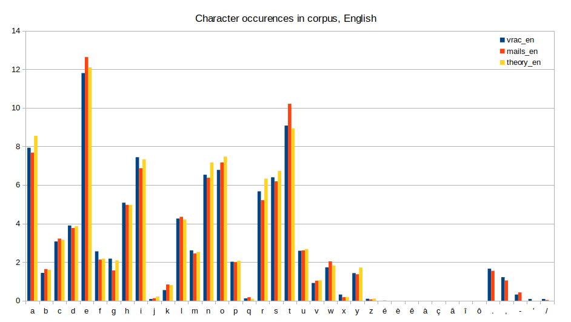
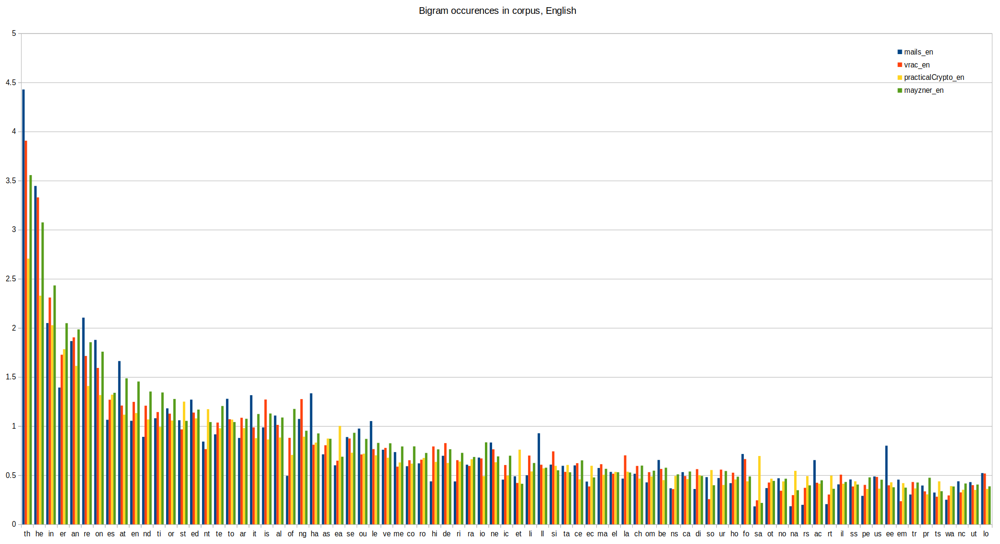
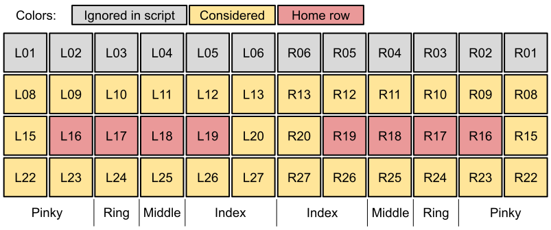
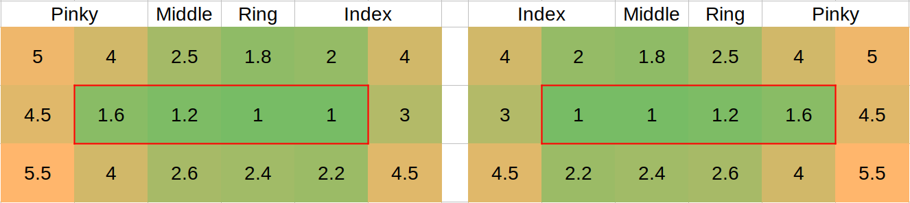
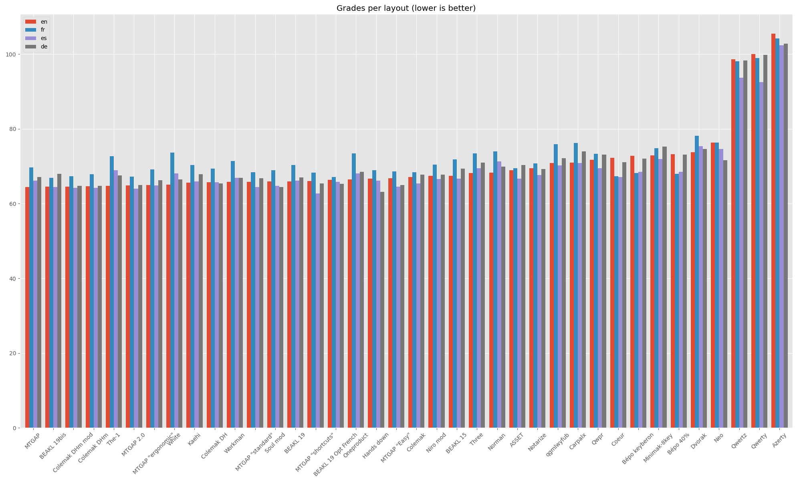

# Keyboard layout evaluation

An evaluation of existing keyboard layouts in order to choose one for my use.

The goal is to compare keyboard layouts for an ergonomic keyboard, for several languages. 
The first step is to gather statistics of characters use for each language; then to implement a method to compare them according to subjective criterias.

The evaluation method relies on grading bigrams according to weights per key and penalties, and applying over bigram frequencies for a language.

# Table of contents

- [Keyboard layout evaluation](#keyboard-layout-evaluation)
- [Table of contents](#table-of-contents)
- [Character statistics](#character-statistics)
  - [Count script](#count-script)
  - [Spreadsheet analysis](#spreadsheet-analysis)
    - [Character counts](#character-counts)
    - [Bigram counts](#bigram-counts)
  - [Takeaway](#takeaway)
- [Layout evaluation](#layout-evaluation)
  - [Focus definition](#focus-definition)
  - [Evaluation principle](#evaluation-principle)
    - [Key base weights](#key-base-weights)
    - [Penalties](#penalties)
  - [Limits](#limits)
    - [Bigram frequencies variations](#bigram-frequencies-variations)
    - [Accented characters](#accented-characters)
  - [Script](#script)
  - [Results](#results)
- [Conclusion](#conclusion)

# Character statistics

Contained in folder `character_stats`.

The [layout evaluation](#layout-evaluation) needs bigram frequencies (sets of 2 letters), for each language.

The frequencies are sourced from the sources I found. I used numbers from [Practical Cryptography](http://practicalcryptography.com/cryptanalysis/letter-frequencies-various-languages/) for English, French, Spanish, and German; and from [Mayzner](http://norvig.com/mayzner.html) for English (to compare).

For comparison my own corpus is also analysed (for English and French); made of my emails, some texts from free books, and some internet articles.

## Count script

Requirements: Python 3, Pandas.

The script `count.py` takes the text files in the `data` folder and outputs the character counts in `chars.csv`, and the bigram counts in `bigrams.csv`. Upper case are converted to lower case.

The list of characters to take into account is configurable in the code, in the list `chars`. Currently it takes the basic alphabet, plus `éèêàçâîô.,-'/`. 

The provided `chars.csv` and `bigrams.csv` files were generated with a personal corpus of emails (`mails_en` and `mails_fr`, 300\~400kB of raw text each) and various free books and articles (`vrac_en` and `vrac_fr`, 200\~400kB each).

## Spreadsheet analysis

This analysis is done in the Libreoffice spreadsheet `stats.ods`.

### Character counts

The characters frequencies for both English and French are quite consistent between the sources and my own corpus.

[Here](images/chars_fr.png) is the same chart for French.

### Bigram counts

The bigram counts show more discrepancies however. The charts below show the top 80 bigrams. 

[Here](images/bigram_fr.png) is the same chart for French.

## Takeaway

For the evaluation, the "theory" numbers will be the average from both sources for English, and the only source I have for other languages. But the differences with my own corpus show the sensitivity of those inputs, therefore the results should be taken with some tolerance.

Additionally the "theory" numbers do not contain characters such as `.,-'/`. This needs to be improved (TODO).

Small differences of grades between layouts won't be conclusive. The analysis should be understood as making a rough estimation of value between layouts, not a precise assessment.

# Layout evaluation

Contained in folder `layout_evaluation`.

## Focus definition

The influence of the physical keyboard is on the weights and penalties. The algorithm is more or less the same otherwise.

The chosen weights are for an ergonomic keyboard, which is why they are symetrical. It would be similar for any non-staggered keyboard (meaning no horizontal shift between rows).

Only the keys on the main "matrix" are taken into account (3×12 matrix), which are reachable by a finger easily. The "numbers" row is ignored as we focus on the alphabetical layout.

Thumb keys available on ergonomic keyboards are ignored as I arbitrarily prefer not to place any alphanumeric character on them.

The keys are designated by a code (hand, row, column). The numbering includes space for some keys unused in the current script, in case of evolution (for instance for [keys on an Ergodox-like keyboard](images/layout_ergodox.svg)).

## Evaluation principle

For each language, the bigram frequencies are imported from the characters statistics, as percentage of use.

The principle is to assign a "difficulty" (weight) to a bigram (two keys typed consecutively). This weight can be multiplied by the bigram frequency, and all the bigram results summed up to get a general difficulty value of the layout.

Weightlayout = sum( Weightbigram × Probabilitybigram )

The bigram weight is composed of:
- The weights assigned to the two key, representing the relative difficulty to push them
- A penalty, representing the added difficulty of pushing those 2 keys one after the other.

Weightbigram = Weightkey1 + Weightkey2 + Penaltykey1 & key2

The results for all layouts and languages are finally normalized compared to Qwerty in English (at 100%).

### Key base weights

The base weights are shown below. The home row is identified in red border. 

They represent the relative difficulty to hit a single key. The proposed values are for an ergonomic keyboard, with vertical columns and a comfortable home row position.

### Penalties

The penalties represent the additional difficulty of to hitting 2 keys consecutively. They come on top of the base weight.

For that reason, they are only taken into account if the 2 keys are hit by the same hand (and are not the same key, like "aa").

Generally the penalties are higher if the same finger is used, and also the more rows separate the 2 keys. They can be negative if the relative position makes the motion easy, such as a close "inward roll" (like "sd" on Qwerty).

| First finger | Second finger | Same row | 1 row jump | 2 rows jump | Comment     |
| :----------- | :------------ | -------: | ---------: | ----------: | :---------- |
| Index        | Index         |      2.0 |        3.0 |         4.0 | Same finger |
| Index        | Middle        |      0.0 |        0.5 |         1.5 |
| Index        | Ring          |      0.0 |        0.3 |         1.0 |
| Index        | Pinky         |      0.0 |        0.3 |         0.6 |
| Middle       | Index         |     -2.0 |       -0.8 |         1.0 | Inward roll |
| Middle       | Middle        |      2.0 |        3.0 |         4.0 | Same finger |
| Middle       | Ring          |      0.0 |        0.5 |         1.5 |
| Middle       | Pinky         |      0.0 |        0.3 |         1.0 |
| Ring         | Index         |     -2.0 |       -0.8 |         0.8 | Inward roll |
| Ring         | Middle        |     -2.5 |       -1.0 |         0.8 | Inward roll |
| Ring         | Ring          |      2.0 |        3.0 |         4.0 | Same finger |
| Ring         | Pinky         |      0.5 |        1.0 |         2.0 |
| Pinky        | Index         |     -2.0 |       -0.8 |         0.2 | Inward roll |
| Pinky        | Middle        |     -2.0 |       -0.8 |         1.0 | Inward roll |
| Pinky        | Ring          |     -2.0 |       -0.8 |         2.0 | Inward roll |
| Pinky        | Pinky         |      2.5 |        3.5 |         5.0 | Same finger |

## Limits

### Bigram frequencies variations

As stated in the character statistics, the results are approximative as the bigram frequencies aren't a precise and objective number for everyone. 

TODO: compare results with personal corpus to estimate deviation

### Accented characters

The results for languages outside English are slightly off because most accented characters are not taken into account. 

Currently the ignored characters are `êàçâîôñäöüß/`, mainly because those characters are absent from most considered layouts. The characters `é` and `è` were added manually to the layouts (on unused keys, on vowel side if there's one) because I particularly care about French, and due to their high frequency (2.85%).

The characters `'` and `-` were also added when missing, on unused keys.

The issue mainly affects German (`äöüß`, 1.56% of the characters), but also French (`êàçâîô`, 0.75%) and Spanish (`ñ`, 0.22%).

To mitigate this effect the bigram frequencies are normalized after removing the ignored characters, so the summed grade is still calculated over 100%.

## Script

Requirements: Python 3, Pandas, Matplotlib.

The script `script.py` uses the bigram statistics from `stats.csv`, and the configuration (key weights, penalties, and layouts definitions) from `config.txt` to generate the results (table and plot).

To customize the script, edit `config.txt` and have a look at the `main()` function.

The code isn't very efficient as it iterates through dataframes to generate the results. It executes in \~10s so in practice it doesn't really matter.

## Results

TODO

Those results are preliminary, while the inputs and algorithm are being refined.

| Layout            | English | French | Spanish | German |
| :---------------- | ------: | -----: | ------: | -----: |
| MTGAP 2.0         |   61.42 |  61.74 |   60.40 |  62.01 |
| MTGAP "ergonomic" |   62.42 |  64.95 |   61.84 |  63.77 |
| Colemak DHm       |   63.29 |  63.78 |   61.93 |  63.87 |
| MTGAP             |   63.37 |  66.35 |   63.85 |  64.88 |
| MTGAP "shortcuts" |   63.64 |  64.88 |   60.79 |  62.66 |
| MTGAP "standard"  |   64.02 |  64.57 |   61.78 |  64.53 |
| Workman           |   64.06 |  68.93 |   65.83 |  65.58 |
| Colemak DH        |   64.67 |  65.87 |   63.98 |  64.89 |
| Kaehi             |   64.95 |  66.96 |   65.24 |  66.74 |
| MTGAP "Easy"      |   64.99 |  64.92 |   62.35 |  62.65 |
| Colemak           |   65.32 |  64.14 |   62.74 |  66.57 |
| Oneproduct        |   65.38 |  71.62 |   67.66 |  67.84 |
| Norman            |   66.59 |  71.15 |   69.75 |  68.38 |
| ASSET             |   67.86 |  66.14 |   64.82 |  69.42 |
| BEAKL             |   68.36 |  71.49 |   68.71 |  72.53 |
| qgmlwyfub         |   69.10 |  73.29 |   69.99 |  71.04 |
| Carpalx           |   69.33 |  73.77 |   70.60 |  73.46 |
| Qwpr              |   69.76 |  69.31 |   66.69 |  70.21 |
| Minimak-8key      |   71.09 |  71.20 |   69.92 |  73.33 |
| Bépo 40%          |   71.46 |  64.77 |   67.15 |  71.02 |
| Coeur             |   73.13 |  66.17 |   66.67 |  71.18 |
| Dvorak            |   74.11 |  76.56 |   75.23 |  74.43 |
| Neo               |   74.92 |  72.98 |   72.74 |  70.35 |
| Qwertz            |   99.39 |  97.94 |   93.59 |  98.85 |
| Qwerty            |  100.00 |  98.75 |   92.01 | 100.04 |
| Azerty            |  108.06 | 104.89 |  103.82 | 104.00 |

# Conclusion

TODO