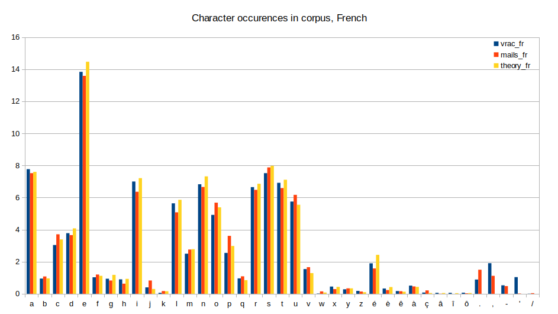
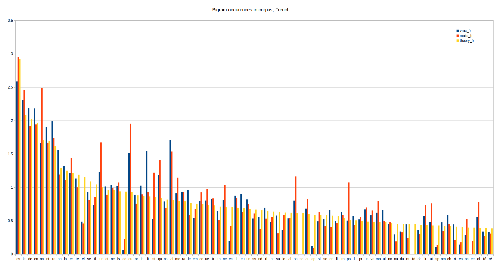

# Keyboard layout evaluation

An evaluation of existing keyboard layouts in order to choose one for my use.

The goal is to compare keyboard layouts for an ergonomic keyboard, for several languages. 
The first step is to gather statistics of characters use for each language; then to implement a method to compare them according to subjective criterias.

The evaluation method relies on grading bigrams according to weights per key and penalties, and applying over bigram frequencies for a language.

# Table of contents

- [Keyboard layout evaluation](#keyboard-layout-evaluation)
- [Table of contents](#table-of-contents)
- [Character statistics](#character-statistics)
  - [Count script](#count-script)
  - [Spreadsheet analysis](#spreadsheet-analysis)
    - [Character counts](#character-counts)
    - [Bigram counts](#bigram-counts)
  - [Takeaway](#takeaway)
- [Layout evaluation](#layout-evaluation)
  - [Principle](#principle)
    - [Key base weights](#key-base-weights)
    - [Penalties](#penalties)
  - [Limits](#limits)
    - [Bigram frequencies variations](#bigram-frequencies-variations)
    - [Accented characters](#accented-characters)
  - [Script](#script)
  - [Results](#results)
- [Conclusion](#conclusion)

# Character statistics

Contained in folder `character_stats`.

The [layout evaluation](#layout-evaluation) needs bigram frequencies (sets of 2 letters), for each language.

The frequencies are sourced from the literature [here](http://practicalcryptography.com/cryptanalysis/letter-frequencies-various-languages/). I focused on English, French, Spanish, and German. 

For comparison my own corpus is also analysed (for English and French); made of my emails, some texts from free books, and some internet articles.

## Count script

Requirements: Python 3, Pandas.

The script `count.py` takes the text files in the `data` folder and outputs the character counts in `chars.csv`, and the bigram counts in `bigrams.csv`. Upper case are converted to lower case.

The list of characters to take into account is configurable in the code, in the list `chars`. Currently it takes the basic alphabet, plus `éèêàçâîô.,-'/`. 

The provided `chars.csv` and `bigrams.csv` files were generated with a personal corpus of emails (`mails_en` and `mails_fr`, 300\~400kB of raw text each) and various free books and articles (`vrac_en` and `vrac_fr`, 200\~400kB each).

## Spreadsheet analysis

This analysis is done in the Libreoffice spreadsheet `stats.ods`.

### Character counts

The characters frequencies for both English and French are quite consistent between the "theory" and my own corpus.

### Bigram counts

The bigram counts show some fairly large discrepancies however. The charts below show the top 80 bigrams. 

## Takeaway

For the evaluation, the "theory" numbers will be used, but this shows that the results should be taken with a big grain of salt. 

Additionally the "theory" numbers do not contain characters such as `.,-'/`.

Small differences of grades between layouts won't be conclusive. The analysis should be understood as making a rough estimation of value between layouts, not a precise assessment.

# Layout evaluation

Contained in folder `layout_evaluation`.

## Principle

For each language, the bigram frequencies are imported from the characters statistics, as percentage of use.

The principle is to assign a "difficulty" (weight) to a bigram (two keys typed consecutively). This weight can be multiplied by the bigram frequency, and all the bigram results summed up to get a general difficulty value of the layout.

Weightlayout = sum( Weightbigram × Probabilitybigram )

The bigram weight is composed of:
- The weights assigned to the two key, representing the relative difficulty to push them
- A penalty, representing the added difficulty of pushing those 2 keys one after the other.

Weightbigram = Weightkey1 + Weightkey2 + Penaltykey1 & key2

The results for all layouts and languages are finally normalized compared to Qwerty in English (at 100%).

### Key base weights

### Penalties

## Limits

### Bigram frequencies variations

As stated in the character statistics, the results are approximative as the bigram frequencies aren't a precise and objective number for everyone. 

TODO: compare results with personal corpus to estimate deviation

### Accented characters

The results between languages are skewed because most accented characters are not taken into account. The effect is that they falsely grade better than English. 

Currently the ignored characters are `êàçâîôñäöüß/`, mainly because those characters are absent from most considered layouts. The characters `é` and `è` were added manually to the layouts (on unused keys, on vowel side if there's one) because I particularly care about French, and due to their high frequency (2.85%).

The characters `'` and `-` were also added when missing, on unused keys.

The issue mainly affects German (`äöüß`, 1.56% of the characters), but also French (`êàçâîô`, 0.75%) and Spanish (`ñ`, 0.22%).

This effect could be mitigated by dropping them from the frequencies and normalizing the remaining ones (TODO).

## Script

Requirements: Python 3, Pandas, Matplotlib.

The script `script.py` uses the bigram statistics from `stats.csv`, and the configuration (key weights, penalties, and layouts definitions) from `config.txt` to generate the results (table and plot).

The code isn't very efficient as it iterates through dataframes to generate the results. It executes in \~10s so in practice it doesn't really matter.

## Results

TODO

Layout|English|French|Spanish|German
:--|--:|--:|--:|--:
MTGAP 2.0|61.42|60.82|60.13|60.07
MTGAP "ergonomic"|62.42|63.98|61.57|61.77
Colemak DHm|63.29|62.82|61.65|61.87
MTGAP|63.37|65.36|63.57|62.85
MTGAP "shortcuts"|63.64|63.92|60.52|60.70
MTGAP "standard"|64.02|63.61|61.51|62.51
Workman|64.06|67.90|65.55|63.53
Colemak DH|64.67|64.89|63.70|62.86
Kaehi|64.95|65.96|64.96|64.65
MTGAP "Easy"|64.99|63.95|62.08|60.69
Colemak|65.32|63.18|62.47|64.49
Oneproduct|65.38|70.55|67.36|65.72
Norman|66.59|70.09|69.44|66.24
ASSET|67.86|65.15|64.53|67.25
BEAKL|68.36|70.43|68.41|70.27
qgmlwyfub|69.10|72.20|69.68|68.82
Carpalx|69.33|72.67|70.30|71.17
Qwpr|69.76|68.28|66.40|68.02
Minimak-8key|71.09|70.13|69.61|71.03
Bépo 40%|71.46|63.80|66.86|68.80
Coeur|73.13|65.19|66.38|68.95
Dvorak|74.11|75.42|74.90|72.10
Neo|74.92|71.89|72.42|68.15
Qwertz|99.39|96.48|93.18|95.76
Qwerty|100.00|97.28|91.61|96.91
Azerty|108.06|103.32|103.36|100.75

# Conclusion

TODO